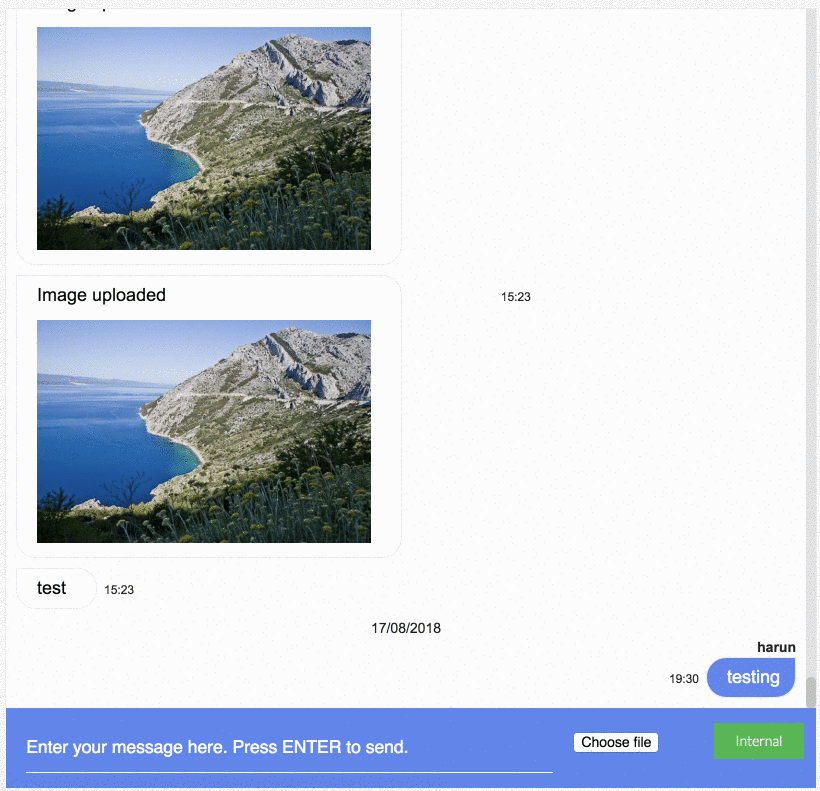

# react-gossip
React chat component for [gossip-js](https://github.com/harund/gossip-js) messaging library.



## Installation

```
yarn add react-gossip
```

or

```
npm install react-gossip
```

## Running a Demo
To run a local demo of `react-gossip`:
- clone this repo
- install dependencies
- set value of `apiBase` prop for examples in `stories/index.js`
- run `yarn storybook`.

## Usage
```
<Gossip
    shouldLog={true}
    apiBase="yourApiBase.com"
    isSSL={true}
    channel="12345"
    channelSecret="some_secret"
    nick="Emir"
    secret="EmirSecret"
    threadId="ema"
    onMessageSent={
        (m) => {
            console.log("Last message sent", m);
        }
    }/>
```

Detailed examples can be found in `stories/index.js`.